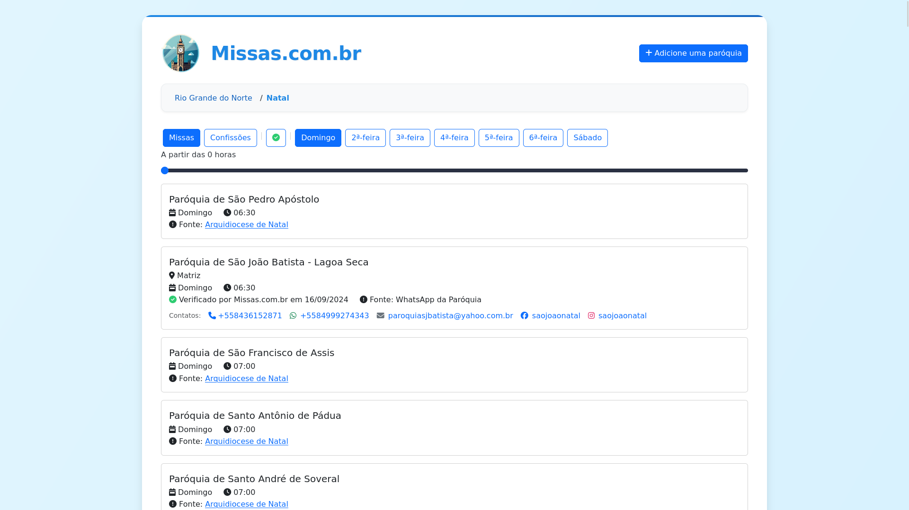

# Missas



## Installation
```bash
git clone git@github.com:lucasrcezimbra/missas.com.br.git
cd missas.com.br
make install
```

### Test
```bash
make test
```

### Run
```bash
make dev
```

#### Scrapers
```shell
poetry run scrapy runspider contrib/scraper_natal.py -o natal.jsonl
```

#### WhatsApp Automation
The WhatsApp automation is still a very manual process. There are two scripts:
- `contrib/whats-extract.js`: extracts the messages from WhatsApp, format them,
  and output to the stdout
- `contrib/import.py`: parse the messages using LLM, ask for confirmation and
  update the database.

Running:
1.
```shell
npm install
node contrib/whats-extract.js
```

2. Copy each output and paste in a new terminal. It should looks like this:
    ```shell
    poetry run python contrib/import.py '+551298765432' '[17:23, 02/12/2024] You:
    Bom dia.

    Aqui é o Lucas do site missas.com.br. Estamos atualizando o nosso site com as informações sobre as paróquias da Arquidiocese de Natal para ajudar os fiéis a encontrar horários de missas e confissões.

    Você poderia me passar os horários de missas e confissões na sua paróquia?

    Desde já obrigado.
    [15:42, 27/12/2024] +55 12 9876-5432:
    Bom dia!
    Perdão pela demora.
    [15:44, 27/12/2024] +55 12 9876-5432:
    Confissões de terça a sexta, 09h às 12h - SECRETARIA PAROQUIAL
    Horários de missas na Igreja Matriz: 07h 19h (domigos)
    17h30 (terça, quinta e sexta)'
    ```
