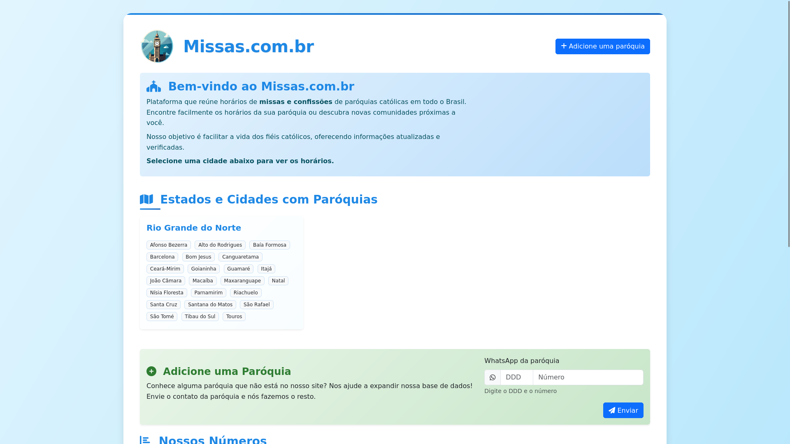

# Missas

<!--toc:start-->
- [Contributing](#contributing)
  - [Installation](#installation)
  - [Test](#test)
  - [Run](#run)
  - [Coverage](#coverage)
  - [Parish facts API](#parish-facts-api)
- [Sponsorship](#sponsorship)
<!--toc:end-->

Website brings together Mass and confession times for Catholic parishes
throughout Brazil (maybe others in the future).




## Contributing
### Installation
Install [uv](https://docs.astral.sh/uv/getting-started/installation/), then run:

```bash
git clone git@github.com:lucasrcezimbra/missas.com.br.git
cd missas.com.br
make install
```

### Test
```bash
make test
```

### Run
```bash
make dev
```

### Coverage
```bash
make coverage
```

### Parish facts API

The read-only Django Ninja endpoint `GET /api/v0/parishes` lists parishes with
recorded WhatsApp contacts, current Mass schedules, and per-schedule verification
and source information. The endpoint is public and cached for 24 hours.

See [the API contract and local end-to-end check](docs/api.md) for the response
schema, offset pagination behavior, cache policy, and test commands. It does not
send messages or update schedules.

## Sponsorship

Sentry supports this project with their [Open-Source Sponsorship Plan](https://sentry.io/for/open-source/)


